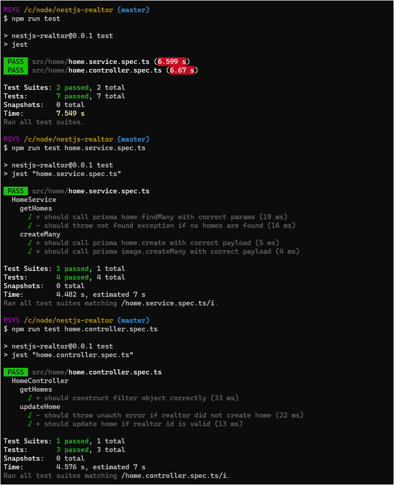

## Description
Realtor app.  
Introduction to NestJS -- Database connection (prisma, docker postgresql) , authentication (jwt), authorization (guard, roles), unit testing.

*A course from Udemy*  
*[The Nest JS Bootcamp - Complete Developer Guide](https://www.udemy.com/course/the-nest-js-bootcamp-complete-developer-guide/)*


## Installation

```bash
$ npm install
```

## Running the app

```bash
# watch mode
$ npm run start:dev
```
## Test

```bash
# unit tests
$ npm run test
```

## Screenshot

